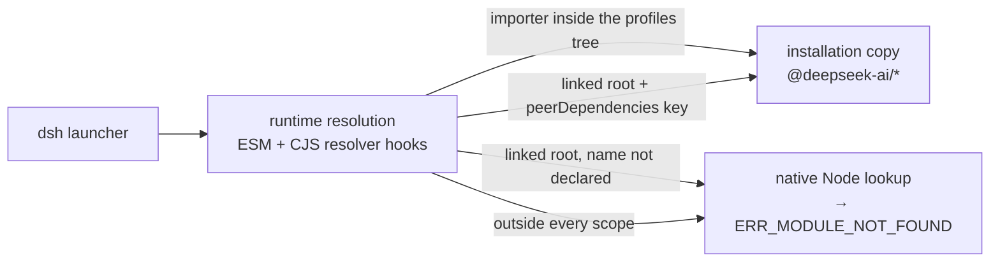
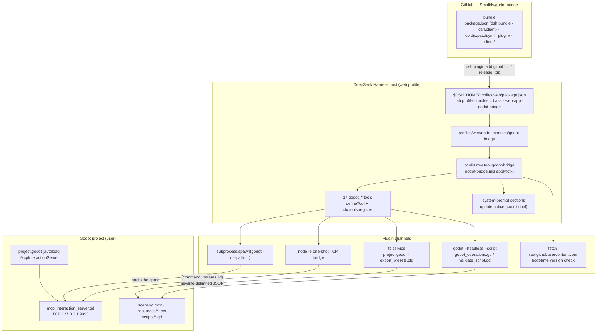
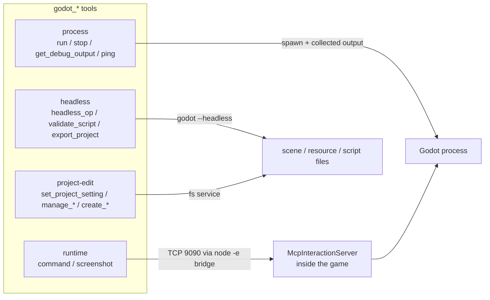
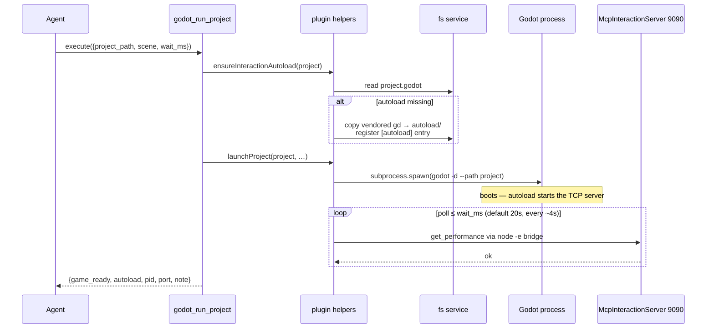
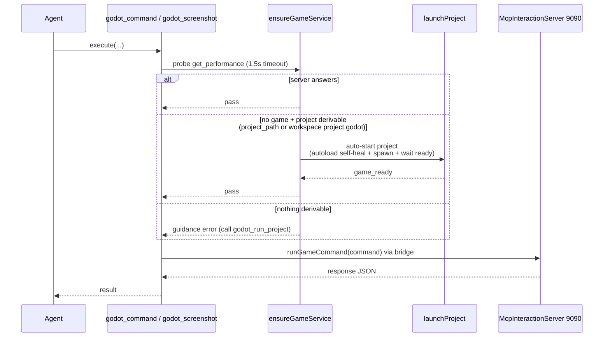

[English](ARCHITECTURE.md) | [中文](ARCHITECTURE.zh-CN.md)

# godot-bridge — architecture

## Why this exists

[godot-mcp](https://github.com/tugcantopaloglu/godot-mcp) is an MCP server (stdio JSON-RPC) wrapping three layers of real work:

1. **Process management** — `spawn(godot -d --path <project>)`, collect output, kill on demand.
2. **Runtime game control** — connect to the game's `McpInteractionServer` autoload on **TCP 127.0.0.1:9090** with newline-delimited JSON `{command, params, id}`; ~105 `game_*` tools map onto these commands.
3. **Headless static operations** — `godot --headless --path <project> --script godot_operations.gd <op> <json>` (scene edits, script validation, project creation).

The MCP layer itself contributes nothing but an outer JSON-RPC shell. DeepSeek Harness already has native equivalents for everything:

| layer | godot-mcp | godot-bridge |
| --- | --- | --- |
| process | Node `spawn` | host `subprocess.spawn` (same args) |
| runtime | TCP 9090 JSON | same TCP 9090 JSON via a one-shot `node -e` bridge |
| headless | `godot --headless …` | included: `godot_headless_op` + `godot_validate_script` over vendored `godot_operations.gd` / `validate_script.gd` |

Crucially, **the game side does not know MCP exists**: `mcp_interaction_server.gd` is a plain TCP JSON server. Replacing the MCP server requires zero game-side changes; `project.godot` autoloads stay as-is.

## The TCP bridge

The dynamic sandbox and the preset environment expose no raw `net` socket to plugin code, so each command spawns a short-lived `node -e` bridge:

```
node -e "<bridge>" <command> <paramsJson>
```

The bridge connects to 127.0.0.1:9090, writes one `{command, params, id:1}\n`, prints the first complete response line, and exits. The game server is single-connection with a `_busy` flag, so this connection-per-command model is a perfect match. `argv[1]`/`argv[2]` carry the command and params (`node -e` puts extra args at index 1+).

## Sandbox interaction (the important one)

DSH's file sandbox (`workspace-write`) restricts writes to the workspace + temp areas. The **shell executor** (pwsh/bash tools) applies that policy to the whole process tree (Windows restricted-token runner), so launching Godot from a shell tool crashes it: Godot writes `user://` (= `%APPDATA%\Godot\app_userdata\<project>\`, startup logs) and dies with `Failed to open 'user://logs/…'` → signal 11.

godot-bridge spawns through the harness's **raw `subprocess` service** — the unconfined primitive the shell executor itself uses internally — so Godot runs normally. Do not launch the game through pwsh/bash tools in a sandboxed session; use `godot_run_project`.

## Tool model

All tools return the game's response JSON verbatim (canonical value validated against `{type:'object', additionalProperties:true}`), rendered as text. Tool calls are exclusive by default (no `isConcurrencySafe`), matching the single-command game server.

## Dependency contract and runtime resolution

A DSH plugin that imports harness packages (`@deepseek-ai/dsh-tools`, `@deepseek-ai/schemastery`, …) never resolves them from the npm registry. The launcher computes one immutable **runtime resolution** — the dependency closure of the installation plus the selected bundles — and installs it into Node's ESM and CommonJS resolvers (DSH 0.2 does this in-process, replacing the 0.1.x physical module-fallback layer; the old `.dsh-module-fallback` directories are only cleaned up). Which modules get that routing is decided per importing path:

- **Inside the profiles tree** (`$DSH_HOME/profiles/<name>/…`): a profile-layer importer is routed to the installation's copy for any `@deepseek-ai/*` package the installation carries. A bundle installed with `dsh plugin add` lives here, so it needs no declaration.
- **Linked root** (a symlink under a profile's `node_modules` whose target lies outside the profiles tree — what a `link:` dependency produces): routed only for package names the importing package declares in its own `peerDependencies`. The resolver reads `peerDependencies` keys, not `dependencies`, and Node's ESM loader resolves symlinks before importing, so the importer path really is the target outside the tree.
- **Anything else** (a path outside both, e.g. a file copied into an agent preset): no routing at all — plain Node lookup, which cannot see the installation's packages.

Two consequences shape this package's manifest:

- `peerDependencies` is a **load-time contract**, not just metadata: without the declaration a `link:` install fails the whole bundle import (`ERR_MODULE_NOT_FOUND: Cannot find package '@deepseek-ai/dsh-tools'`) and none of the seventeen tools registers — the 0.1.7-and-earlier behaviour on DSH 0.2.
- DSH also **gates** declared `@deepseek-ai/dsh` / `@deepseek-ai/dsh-*` peers against the runtime version (prereleases participate in the range match). A range that does not match makes the launcher skip the bundle with an explicit message; a missing peer imposes no constraint and therefore can never cause a skip. That is why the declaration is a range (`>=0.1.6-0`) rather than a pin, and why `peerDependenciesMeta.optional` marks the harness packages: pnpm must never fetch them from the registry.

The **browser half** is a different contract and deliberately declares nothing here. `dsh.client` makes the host serve `exports["./client"]` as a classic script to the web client, and that script's factory resolves its imports against the client's own platform module table (React and a few static libraries) instead of Node — so no `peerDependencies` entry participates. It exists for one reason: the Plugins page renders a configuration section only for a bundle whose browser half registers one of its slots, and this half registers `plugins.bundle.config` under the package name, which is what puts the `Godot engine path` field on the `godot-bridge` card's page. Its writes take the client settings road (`configForms` scope → the settings service → `configEditor.edit`), i.e. the same profile patch the `godot_set_engine_path` tool writes.



`npm run check` enforces the declaration statically; `scripts/diagnose-dsh-resolution.mjs` prints what a running launcher actually routes.

## Architecture diagrams

### System overview



### Tool channels



### godot_run_project — launch flow



### Runtime tool pre-flight (self-healing guard)



## Known behavior notes

- `eval` compile errors pause a debug-mode game at the debugger (identical to godot-mcp). Recover with `godot_stop_project` + `godot_run_project`; write dynamic-access code (`node.get("prop")`) to dodge static typing.
- `godot_get_debug_output` is incremental (offset-based readers).
- The configured Godot path must be the real exe; a version-manager shim exits immediately and orphans the real process.
