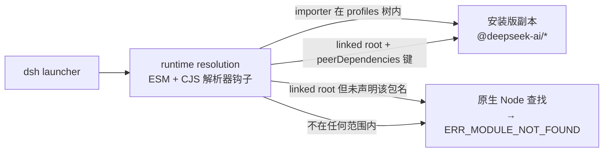
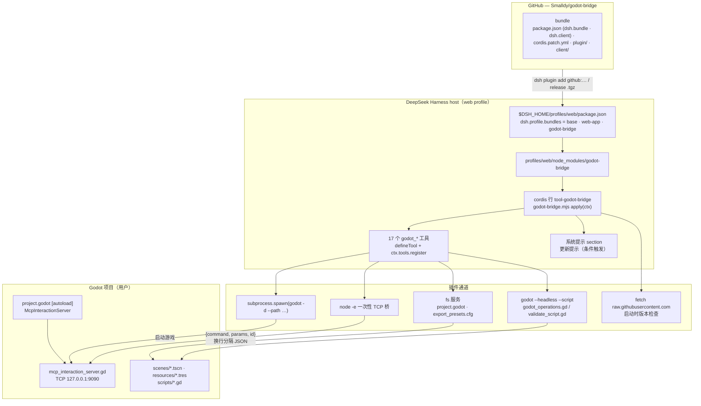
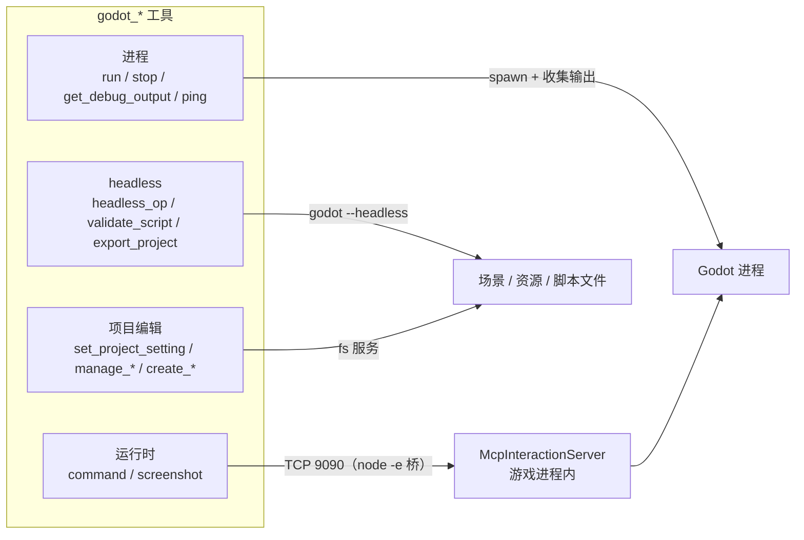
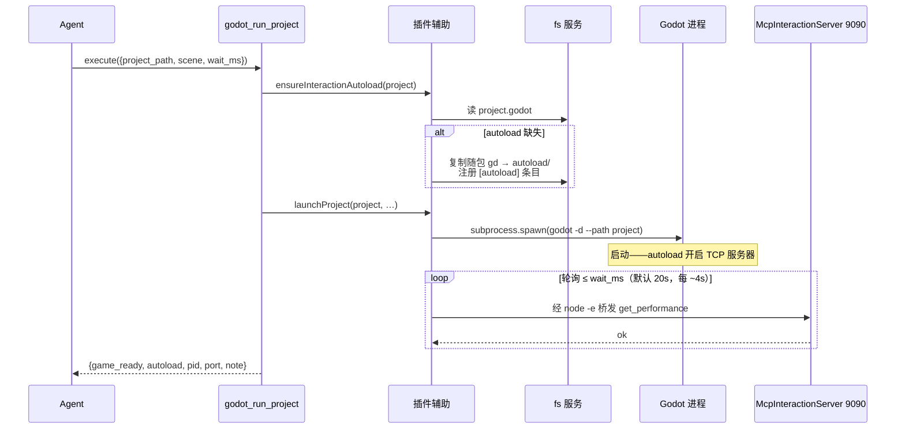
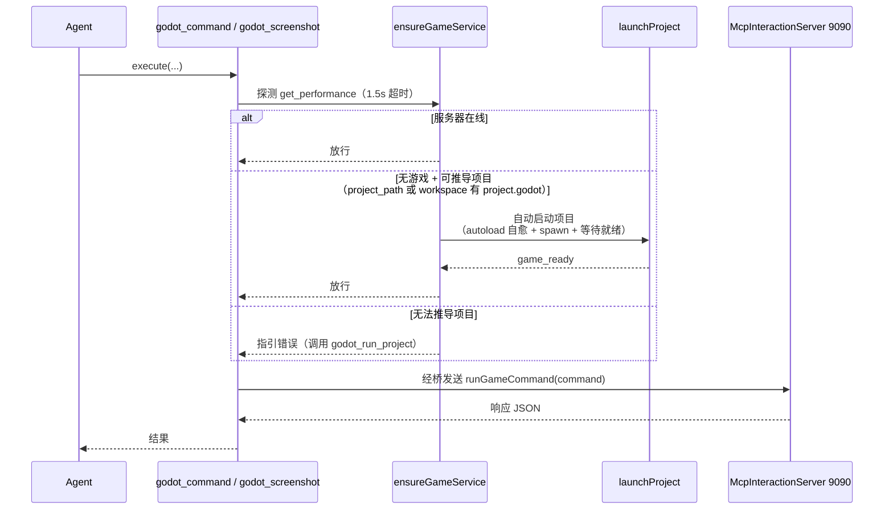

[English](ARCHITECTURE.md) | **中文**

# godot-bridge — 架构说明

## 为什么存在

[godot-mcp](https://github.com/tugcantopaloglu/godot-mcp) 是一个 MCP 服务器（stdio JSON-RPC），包了三层真正的活：

1. **进程管理** — `spawn(godot -d --path <project>)`、收集输出、按需杀掉。
2. **运行时游戏控制** — 连接游戏内 `McpInteractionServer` autoload 的 **TCP 127.0.0.1:9090**，用换行分隔 JSON `{command, params, id}` 通信；约 105 个 `game_*` 工具映射到这些命令。
3. **headless 静态操作** — `godot --headless --path <project> --script godot_operations.gd <op> <json>`（场景编辑、脚本校验、项目创建等）。

MCP 层本身除了一个外层 JSON-RPC 外壳外什么都没贡献。DeepSeek Harness 对每一层都有原生等价物：

| 层 | godot-mcp | godot-bridge |
| --- | --- | --- |
| 进程 | Node `spawn` | host `subprocess.spawn`（同样参数） |
| 运行时 | TCP 9090 JSON | 同一 TCP 9090 JSON，经一次性 `node -e` 桥 |
| headless | `godot --headless …` | 已实现：`godot_headless_op` + `godot_validate_script`，基于随包内置的 `godot_operations.gd` / `validate_script.gd` |

关键在于：**游戏侧根本不知道 MCP 的存在**——`mcp_interaction_server.gd` 只是一个普通 TCP JSON 服务器。替换 MCP 服务器不需要改游戏侧任何东西；`project.godot` 的 autoload 原样保留。

## TCP 桥

动态沙箱和预设环境都不向插件代码暴露原始 `net` socket，所以每条命令拉起一个短命的 `node -e` 桥：

```
node -e "<bridge>" <command> <paramsJson>
```

桥连接 127.0.0.1:9090，写入一行 `{command, params, id:1}\n`，打印第一条完整响应行，退出。游戏服务器是单连接 + `_busy` 标志，这种按命令短连接的模型完美匹配。命令和参数位于 `argv[1]`/`argv[2]`（`node -e` 把额外参数放在索引 1 之后）。

## 沙箱交互（重点）

DSH 的文件沙箱（`workspace-write`）只允许写 workspace 和临时目录。**shell 执行器**（pwsh/bash 工具）把该策略应用到整个进程树（Windows 受限令牌执行器），所以从 shell 工具启动 Godot 会崩：Godot 要写 `user://`（= `%APPDATA%\Godot\app_userdata\<项目名>\`，启动日志），被拒后报 `Failed to open 'user://logs/…'` → signal 11。

godot-bridge 走 harness 的**原始 `subprocess` 服务**——shell 执行器自己内部也在用的不受限原语——所以 Godot 正常运行。**不要在沙箱会话里用 pwsh/bash 工具启动游戏**，用 `godot_run_project`。

## 工具模型

所有工具原样返回游戏的 JSON 响应（规范化值按 `{type:'object', additionalProperties:true}` 校验），以文本渲染。工具调用默认排他（无 `isConcurrencySafe`），与单命令游戏服务器匹配。

## 依赖契约与运行时解析

要 import harness 包（`@deepseek-ai/dsh-tools`、`@deepseek-ai/schemastery` 等）的 DSH 插件，从不从 npm registry 解析这些包。launcher 会计算一份不可变的 **runtime resolution**——安装版自身的依赖闭包 + 已选 bundle——并把它装进 Node 的 ESM 与 CommonJS 解析器（DSH 0.2 是进程内实现，取代了 0.1.x 的物理 module-fallback 层；旧的 `.dsh-module-fallback` 目录只保留清理逻辑）。哪些模块能拿到这种路由，按「发起 import 的路径」决定：

- **在 profiles 树内**（`$DSH_HOME/profiles/<name>/…`）：profile 层的 importer 对安装版携带的任意 `@deepseek-ai/*` 包都会被路由到安装版副本。用 `dsh plugin add` 装进来的 bundle 就在这里，因此无需任何声明。
- **linked root**（profile 的 `node_modules` 下、目标落在 profiles 树之外的符号链接——`link:` 依赖的产物）：只有在「发起 import 的包」自己的 `peerDependencies` 里声明了该包名时才会被路由。解析器读的是 `peerDependencies` 的键（不是 `dependencies`），而 Node 的 ESM loader 会先 realpath 再 import，所以 importer 路径确实是树外的真实目标路径。
- **其他位置**（树外且非 linked root，例如被复制进 agent 预设的文件）：完全没有路由——走原生 Node 查找，看不到安装版的包。

由此有两条约束塑造了本包的 manifest：

- `peerDependencies` 是**加载期契约**，不只是元数据：缺声明时 `link:` 安装会让整个 bundle import 失败（`ERR_MODULE_NOT_FOUND: Cannot find package '@deepseek-ai/dsh-tools'`），17 个工具一个都不注册——这就是 0.1.7 及更早版本在 DSH 0.2 上的表现。
- DSH 还会用运行时版本**门禁**已声明的 `@deepseek-ai/dsh` / `@deepseek-ai/dsh-*` peers（预发布版本参与范围匹配）。范围不匹配时 launcher 会带明确信息 skip 该 bundle；而**未声明** peer 不构成约束，因此永远不可能导致 skip。这就是为什么声明用范围（`>=0.1.6-0`）而不是精确锁定，也是为什么用 `peerDependenciesMeta.optional` 标注这些 harness 包：pnpm 绝不能去 registry 拉它们。

**浏览器半侧**是另一套契约，且在这里刻意什么都不声明。`dsh.client` 让宿主把 `exports["./client"]` 作为经典 script 供给 web 客户端，该 script 的工厂在客户端自己的平台模块表（React 与少数静态库）里解析 import，而不是走 Node——因此没有任何 `peerDependencies` 条目参与其中。它存在的理由只有一个：DSH 只为「浏览器半侧注册了 keyed slot `plugins.row.config`」的行渲染配置表单，而正是这条注册把 `Godot engine path` 字段放到了插件页的 `tool-godot-bridge` 行上。它的保存走客户端设置通道（`form.mutate` → 设置服务 → `configEditor.edit`），也就是 `godot_set_engine_path` 工具写入的同一个 profile patch。



`npm run check` 静态守护这份声明；`scripts/diagnose-dsh-resolution.mjs` 打印运行中的 launcher 实际路由了什么。

## 架构图

### 系统总览



### 工具通道



### godot_run_project — 启动流程



### 运行时工具前置守卫（自愈）



## 已知行为说明

- `eval` 编译错误会让 debug 模式的游戏卡在调试器（与 godot-mcp 完全相同）。用 `godot_stop_project` + `godot_run_project` 恢复；写动态访问代码（`node.get("prop")`）绕开静态类型推断。
- `godot_get_debug_output` 是增量式的（offset 读取器）。
- 配置的 Godot 路径必须是真实 exe；版本管理器 shim 会立即退出并把真实进程变孤儿。
